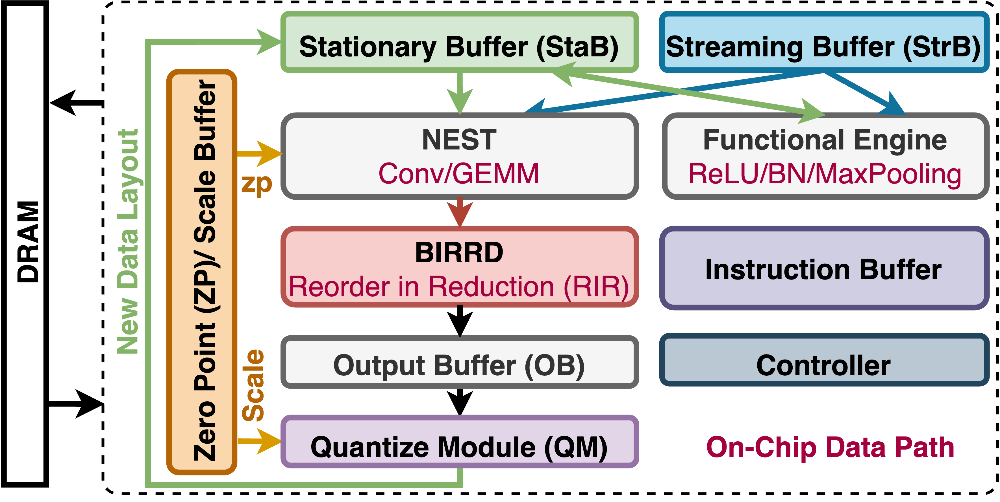
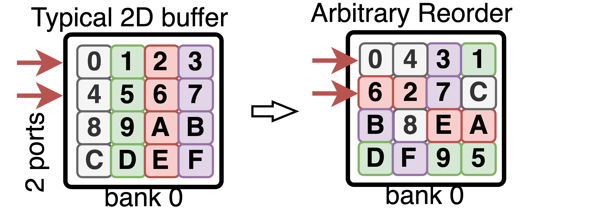

<!-- markdownlint-disable MD001 MD041 -->
<p align="center">
  
</p>

<h3 align="center">
FEATHER: End-to-end deployable reconfigurable AI accelerator.
</h3>
<p align="center">
Open-Architecture, Open-ISA, Open-Compilation Flow
</p>
<p align="center">
| <a href="https://arxiv.org/abs/2405.13170"><b>paper</b></a> | 
  <a href="https://github.com/maeri-project/FEATHER"><b>code</b></a> | 
  <a href="https://maeri-project.github.io/feather_tutorial/"><b>tutorial</b></a> | 
  <a
    href="https://docs.google.com/presentation/d/1b_yGpuQd70Zo1Lj_AB6o9Y7BOjgpJ0oh8RGTD_7-yG4/edit?usp=sharing"><b>slide</b></a> | 
  <a href="https://youtu.be/FgTaYiEArrI"><b>ISCA Talk</b></a> | 
  <a href="https://youtu.be/FA6IMiRmQmw"><b>Deep Dive Talk</b></a> | 
</p>

# FEATHER: A Reconfigurable Accelerator with Data Reordering Support for Low-Cost On-Chip Dataflow Switching
[](./LICENSE)

# What's FEATHER?
FEATHER is the first reconfigurable AI Accelerator that supports (dataflow, layout) co-switching per layer, with the architecture shown below.



Functionality-wise, FEATHER supports arbitrary reordering to ensure arbitrary layout changes.



Performance-wise, FEATHER implements Reorder In Reduction (RIR) to hide the reordering latency behind the critical path.


- For dataflow switching, FEATHER proposes a reconfigurable 2D compute array, termed NEST (Neural Engine for Spatial forwarding and Temporal reduction)
- For layout switching, FEATHER proposes a reconfigurable NoC, termed BIRRD (Butterfly Interconnect for Reordering in Reduction of Dataflow)
1. BIRRD supports arbitrary reoredering in functionality.
2. BIIRD implements data reordering in data reduction (RIR) to hide reordering latency behind the critical path.

# News

We augment LayoutLoop with more precise layout modeling, better userability! **Now LayoutLoop is integrated into official NVlabs/Timeloop**, Check out this [PR](https://github.com/NVlabs/timeloop/pull/301) and this [PR](https://github.com/NVlabs/timeloop/pull/304)

The MINISA toolchain (ISPASS'26) is now bundled in this repository under [`minisa/`](minisa/) — a parametric ISA, compiler, and verification flow on top of FEATHER+ that achieves 474–9,331× compression over direct micro-configuration.

# Repository Contents

This repository hosts the full FEATHER stack — the original ISCA'24 hardware artifacts plus the MINISA ISPASS'26 ISA toolchain. The table below maps every top-level directory to its functionality.

| Path | Functionality |
|------|---------------|
| [`minisa/`](minisa/) | **MINISA ISA toolchain.** Parametric ISA spec, mapping–layout co-search, trace generation, and per-cycle config-stream expansion for FEATHER+. |
| [`End2end_Deployment/`](End2end_Deployment/) | End-to-end **FPGA (ZCU104) deployment** of FEATHER running ResNet-50 — pre-built bitstream (`FEATHER.bit`), hardware handoff (`FEATHER.hwh`), and the orchestration notebook (`feather.ipynb`). |
| [`LayoutLoop/`](LayoutLoop/) | **Layout-aware dataflow DSE.** TimeLoop fork augmented with precise layout-based memory modeling and a layout–mapping co-search algorithm. Includes ready-to-run configurations for FEATHER, SIGMA, SIMBA, Eyeriss, Edge-TPU, NVDLA, MTIA-like, Medusa-like, and pre-run search results. |
| [`FEATHER_RTL/`](FEATHER_RTL/) | **ASIC RTL** for the FEATHER on-chip computation block plus pre-collected synthesis and PnR reports (Synopsys DC + Cadence Innovus) covering 4×4 through 64×128 PE arrays. |
| [`figure/`](figure/) | Architecture and result figures referenced by the README and paper. |
| [`results_generation.py`](results_generation.py) | One-shot script that regenerates every figure in the ISCA'24 paper from the pre-collected numbers (~3 minutes). |
| [`artifact_evaluation_isca.md`](artifact_evaluation_isca.md) | Step-by-step instructions for the ISCA'24 artifact evaluation (Figures 12, 13, 14). |

## `minisa/` — MINISA ISA Toolchain

The MINISA toolchain is the active software stack for compiling matrix-multiply
and convolution workloads down to FEATHER+ control words. The full ISA
specification, instruction formats, and 6-stage compilation pipeline are
documented in [`minisa/README.md`](minisa/README.md). At a glance:

### What MINISA Provides

- **An 8-instruction, variable-width ISA** (3-bit opcode): `SetWVNLayout`,
  `SetIVNLayout`, `SetOVNLayout`, `ExecuteStreaming`, `ExecuteMapping`, `Load`,
  `Store`, plus a reserved `Activation` opcode. Field widths scale as
  $O(\log\text{AH} + \log\text{AW} + \log\text{SRAM})$; DMA instructions are a
  fixed 33 bits.
- **A mapping–layout co-search compiler** that lowers $C[M,N] = A[M,K] \times B[K,N]$
  (and im2col-converted convolutions) into MINISA traces by jointly choosing
  tile sizes, VN groupings, PE-column combining, and the
  $\text{order}_W \times \text{order}_I \times \text{order}_O$ layout
  permutation that is bank-conflict-free.
- **A two-tier verification harness**: Checking Point 1 simulates the ISA
  trace and compares against `numpy.matmul`; Checking Point 2 expands the
  trace to a per-cycle config stream and verifies cycle counts and outputs.
  450 / 450 workload-config pairs pass in the bundled evaluation suite.
- **Cycle-accurate performance modeling** of the 5-engine async FEATHER+
  pipeline (DMA load, weight load, streaming, BIRRD drain, DMA store) and
  instruction-fetch overhead.
- **GPU/TPU baselines and analysis** comparing FEATHER+ against TPUv6e8 (8 ×
  256×256 PEs) and Ampere+ GPUs across the same workload set, with adaptive
  workload partitioning.
- **Multi-layer search** that resolves $\text{OVN}^{(i)} = \text{IVN}^{(i+1)}$
  inter-layer constraints, falling back to off-chip re-layout when no
  consistent layout exists.
- **An interactive GUI** (`python -m minisa gui`) for visualising the PE
  array, BIRRD switching, and per-instruction performance.
- **Publication-quality plotting** scripts (`minisa/figure_drawer/`) for the
  instruction-reduction, latency-breakdown, speedup, and GPU/TPU comparison
  figures.

### Quick Start

```bash
conda create --name minisa python=3.13 && conda activate minisa
pip install numpy pandas pyyaml matplotlib

# Single-workload search
python -m minisa search -M 24 -K 48 -N 512 --ah 16 --aw 16 --verify

# Full evaluation: 50 workloads × 9 hardware configs (96+ GB RAM for --jobs 16)
python -m minisa evaluate \
    --csv minisa/MINISA_Evaluation_Setup_Full.csv \
    --out-dir out_eval_full \
    --ah 4,8,16 --aw "4,16,64/8,32,128/16,64,256" \
    --verify --jobs 16

# Generate paper figures
python -m minisa plot \
    --bench-csv out_eval_full/benchmark_summary.csv \
    --inst-csv  out_eval_full/inst_compare.csv \
    --out-dir   out_eval_full

# Interactive visualization
python -m minisa gui
```

The CLI also exposes `search`, `instcmp` (MINISA vs explicit micro-instruction
comparison), `compare` (GPU/TPU analysis), and a JSON template mode for
ACT-style layout-constrained search. Supported PE-array configurations are
$\text{AH} \in \{4, 8, 16\}$ paired with three $\text{AW}$ widths each, for
nine total designs.

## `End2end_Deployment/` — FPGA Deployment

A self-contained Vivado bitstream and PYNQ notebook that run weight-shared
ResNet-50 inference end-to-end on a Xilinx ZCU104. The artifact is exposed
through a hosted Jupyter endpoint so reviewers can replay the FPGA experiment
without local board access. See
[`End2end_Deployment/README.md`](End2end_Deployment/README.md) for credentials
and the per-layer comparison flow against the Xilinx DPU baseline.

## `LayoutLoop/` — Dataflow + Layout Design Space Exploration

LayoutLoop extends TimeLoop with realistic layout-based memory modeling,
per-dataspace physical ranks, and a layout–mapping co-search algorithm. The
folder ships with:

- A buildable LayoutLoop tree (`layoutloop/`) — `scons -j<N>` inside a
  TimeLoop-compatible toolchain.
- Configuration packs (`configurations/`) for FEATHER and seven baselines
  (SIGMA, SIMBA, Edge-TPU systolic, Eyeriss-like, NVDLA-like, MTIA-like,
  Medusa-like, etc.) covering both regular and depth-wise convolution
  constraint sets.
- Layer-shape collections for ResNet-18/50, MobileNet-V3, BERT (incl.
  conv-form), AlexNet, and small/large VGG.
- `prerun_results/` containing the searched dataflows and the four CSVs
  (`utilization.csv`, `cycle.csv`, `pj_compute.csv`, and the merged
  `interleave_layoutloop_search.csv`) used to populate Figure 13.
- A Docker image reference (`feather_layoutloop`) for one-shot reproducibility.

LayoutLoop has since been upstreamed into NVlabs/Timeloop (PRs
[#301](https://github.com/NVlabs/timeloop/pull/301) and
[#304](https://github.com/NVlabs/timeloop/pull/304)).

> **Scope note.** LayoutLoop is an *analytical* cost model used to compare
> FEATHER against baseline accelerators that have no deployable compilation
> flow of their own. It does not emit executable code. For realistic
> compilation targeting FEATHER+ hardware, use the MINISA toolchain in
> [`minisa/`](minisa/).

## `FEATHER_RTL/` — ASIC Verilog and Synthesis Reports

Verilog sources for the on-chip computation block (NEST + BIRRD + buffers +
controller) used for ASIC synthesis and PnR, plus pre-collected report
bundles. The headline area / power numbers (1 GHz target, all configurations):

| Config  | Area (µm²)   | Power (mW) |
|---------|-------------:|-----------:|
| 64×128  | 36,920,519.7 |  26,400.00 |
| 64×64   | 18,389,176.2 |  13,200.00 |
| 32×32   |  2,727,906.7 |     961.70 |
| 16×32   |    965,665.1 |     655.55 |
| 16×16   |    475,897.2 |     323.48 |
| 8×8     |     97,976.5 |      65.25 |
| 4×4     |     24,694.0 |      16.28 |

Reports include `feather_top_area.rpt`, `feather_top_dw_area.rpt`,
`feather_top_power.rpt`, and `feather_top_timing.rpt` per configuration.
Re-running synthesis requires Synopsys Design Compiler and Cadence Innovus
(end-to-end ≈5 days).

## `results_generation.py`

A single Python file that regenerates every quantitative figure in the
ISCA'24 paper from the embedded pre-collected results. Each figure is a
top-level function (`figure_2()`, `figure_12()`, `figure_13()`, …); call them
individually if you only need one plot. Total runtime for all figures is
approximately 3 minutes after the dependencies above are installed.

# Artifact Evaluation

For the step-by-step ISCA'24 artifact evaluation flow (Pre-run reproduction,
Experiment Sets 1–3, FPGA login, LayoutLoop DSE, ASIC synthesis), see
[`artifact_evaluation_isca.md`](artifact_evaluation_isca.md).

# Maintainers

- Jianming Tong (jianming.tong@gatech.edu)
- Anirudh Itagi (aitagi7@gatech.edu)
- Yujie Li
- Tushar Krishna

# Citations

```bibtex
@inproceedings{tong2024FEATHER,
  author    = {Tong, Jianming and Itagi, Anirudh and Chatarasi, Parsanth and Krishna, Tushar},
  title     = {FEATHER: A Reconfigurable Accelerator with Data Reordering Support
               for Low-Cost On-Chip Dataflow Switching},
  booktitle = {Proceedings of the 51st Annual International Symposium on Computer Architecture},
  series    = {ISCA '24},
  year      = {2024},
  publisher = {Association for Computing Machinery},
  location  = {Argentina},
  keywords  = {flexible accelerator, dataflow-layout coswitching},
}

@inproceedings{tong2026MINISA,
  author    = {Tong, Jianming and Li, Yujie and Jain, Devansh and Mendis, Charith and Krishna, Tushar},
  title     = {MINISA: Minimal Instruction Set Architecture for Next-gen Reconfigurable Inference Accelerator},
  booktitle = {Proceedings of the 34th Annual International Symposium on Performance Analysis of Systems and Software},
  series    = {ISPASS '26},
  year      = {2026},
  location  = {Seoul, Korea},
  keywords  = {minimal instruction set architecture, reconfigurable accelerator, virtual neurons},
}
```
